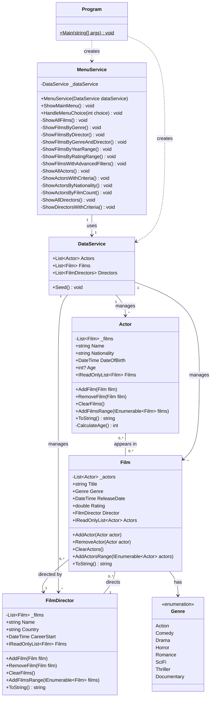

# Film Database - Project .NET Framework

* Naam: Romeo Weyns
* Studentennummer: 0177605-95
* Academiejaar: 25-26
* Klasgroep: INF-202A
* Onderwerp: Film, Actor, FilmDirector

## Sprint 1 

### UML Class Diagram



## Sprint 3

### Beide zoekcriteria ingevuld

```sql
SELECT "a"."ImdbId", "a"."Age", "a"."DateOfBirth", "a"."Name", "a"."Nationality"
FROM "Actors" AS "a"
WHERE instr(upper("a"."Name"), @__ToUpper_0) > 0 AND "a"."Age" >= @__minimumAge_1
-- Name = "Emma" AND MinimumAge = 20
```

### Enkel zoeken op naam

```sql
SELECT "a"."ImdbId", "a"."Age", "a"."DateOfBirth", "a"."Name", "a"."Nationality"
FROM "Actors" AS "a"
WHERE instr(upper("a"."Name"), @__ToUpper_0) > 0
-- Name = "Emma"
```

### Enkel zoeken op minimum leeftijd

```sql
SELECT "a"."ImdbId", "a"."Age", "a"."DateOfBirth", "a"."Name", "a"."Nationality"
FROM "Actors" AS "a"
WHERE "a"."Age" >= @__minimumAge_0
-- MinimumAge = 20
```

### Beide zoekcriteria leeg

```sql
SELECT "a"."ImdbId", "a"."Age", "a"."DateOfBirth", "a"."Name", "a"."Nationality"
FROM "Actors" AS "a"
```

---