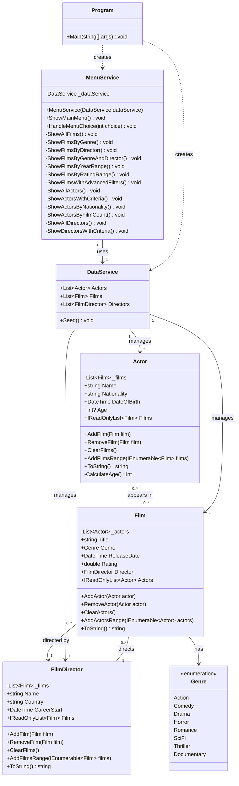

# Film Database - Project .NET Framework

* Naam: Romeo Weyns
* Studentennummer: 0177605-95
* Academiejaar: 25-26
* Klasgroep: INF-202A
* Onderwerp: Film, Actor, FilmDirector

## UML Class Diagram

